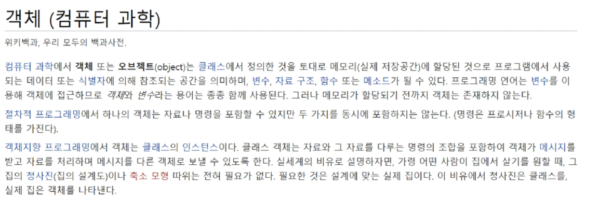

# OOP

## 객체

- 파이썬은 모두 객체(object)로 이뤄져있다.
- 객체(object)는 특정 타입의 인스턴스(instance)이다.
  - 123, 900, 5 는 모두 int의 인스턴스
  - 'hello', 'bye'는 모두 string의 인스턴스
  - [232, 89, 1], [ ]은 모두 list의 인스턴스
- 객체(object)의 특징
  - 타입(type) : 어떤 연산자(operator)와 조작(method)가 가능한가?
  - 속성(attribute) : 어떤 상태(데이터)를 가지는가?
  - 조작법(method): 어떤 행위(함수)를 할 수 있는가?

### 프로그래밍 패러다임(Programming Paradigms)

- 기능에 따라 프로그래밍 언어를 분류하는 방법

1. 명령형 프로그래밍()
   - ㅁㄴㄹ

