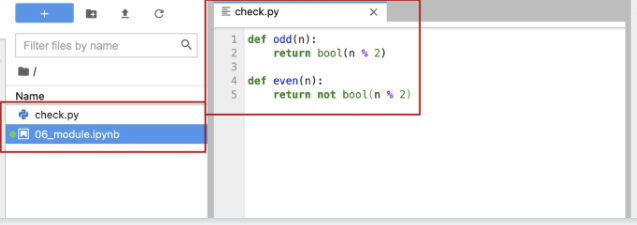
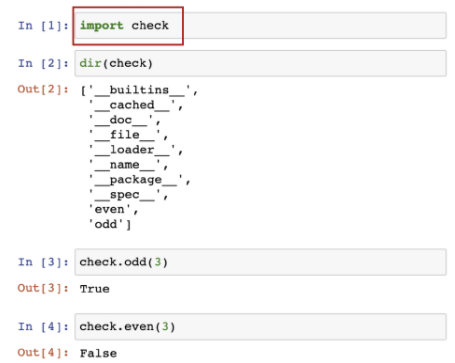
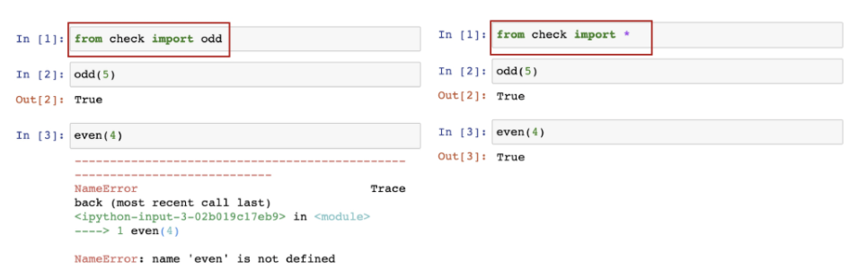

# 모듈(Module) & 가상환경


## 모듈과 패키지

- 모듈
  - 특정 기능을 파이썬 파일(.py) 단위로 작성한 것
- 패키지
  - 특정 기능과 관련된 여러 모듈의 집합
  - 패키지 안에는 또 다른 서브 패키지를 포함

### 파이썬 표준 라이브러리(Python Standard Library, PSL)

> [파이썬 표준 라이브러리 — Python 3.9.6 문서](https://docs.python.org/ko/3/library/index.html)

- 파이썬에 기본적으로 설치된 모듈과 내장 함수
  - ex - random.py

### 파이썬 패키지 관리자(pip)

- PyPI(Python Package Index)에 저장된 외부 패키지들을 설치하도록 도와주는 패키지 관리 시스템
  - ex - requests, beautifulsoup

### 파이썬 패키지 관리자(pip) 명령어

- 패키지 설치

  - 최신 버전/ 특정 버전/ 최소 버전을 명시하여 설치 할 수 있음

    - $ pip install somePackage
    - $ pip install SomePackage==1.0.5
    - $ pip install 'SomePackage>=1.0.4'

    > 모두 bash, cmd 환경에서 사용되는 명령어

- 패키지 삭제

  - pip는 패키지를 업그레이드 하는 경우 과거 버전을 자동으로 지워줌
    - $ pip uninstall SomePackage

- 패키지 목록 및 특정 패키지 정보

  - $ pip list
  - $ pip show SomePackage

- 패키지 freeze

  - 설치된 패키지의 비슷한 목록을 만들지만, pip install에서 활용되는 형식으로 출력
  - 해당하는 목록을 requirements.txt(관습)으로 만들어 관리함
    - $ pip freeze

- 패키지 관리하기

  - 아래의 명령어들을 통해 패키지 목록을 관리하고 설치할 수 있음

  - 일반적으로 패키지를 기록하는 파일의 이름은 requirements.txt로 정의함
    - $ pip freeze > requirements.txt
    - $ pip install -r requirements.txt
    
    > 두 개 이상의 컴퓨터 환경맞출 때 용이함. 
    
  - 다양한 파이썬 프로젝트에서 사용됨

    > 파이썬으로 된 프로젝트를 살펴보면 requirements.txt도 같이 올려줌. 


모듈 - 패키지 - 라이브러리 


## 가상환경

- 파이썬 표준 라이브러리가 아닌 외부 패키지와 모듈을 사용하는 경우 모두 pip를 통해 설치를 해야함
- 복수의 프로젝트를 하는 경우 버전이 상이할 수 있음
  - 과거 외주 프로젝트 - django 버전 2.x
  - 신규 회사 프로젝트 - django 버전 3.x
- 이러한 경우 가상환경을 만들어 프로젝트별로 독립적인 패키지를 관리 할 수 있음


### venv

- 가상 환경을 만들고 관리하는데 사용되는 모듈(Python 버전 3.5부터)
- 특정 디렉토리에 가상 환경을 만들고 , 고유한 파이썬 패키지 집합을 가질 수 있음
  - 특정 폴더에 가상 환경이(패키지 집합 폴더 등) 있고
  - 실행 환경(예-bash)에서 가상환경을 활성화 시켜
  - 해당 폴더에 있는 패키지를 관리/사용함

### 가상환경 생성

- 가상환경을 생성하면, 해당 디렉토리에 별도의 파이썬 패키지가 설치됨

  - $ python -m venv <폴더명>

  > 가상환경 폴더명을 venv로 약속

### 가상환경 활성화/비활성화

- 아래의 명령어를 통해 가상환경을 활성화
  - <venv>는 가상환경을 포함하는 디렉토리의 경로

| 플랫폼 | 셸              | 가상 환경을 활성화하는 명령         |
| ------ | --------------- | ----------------------------------- |
| POSIX  | bash/zsh        | $ source <venv>/bin/activate        |
|        | fish            | $ source <venv>/bin/activate.fish   |
|        | csh/tcsh        | $ source <venv>/bin/activate.csh    |
|        | PowerShell Core | $ <venv>/bin/Activate.ps1           |
| 윈도우 | cmd.exe         | C:\> <venv>\Scripts\activate.bat    |
|        | PowerShell      | PS C:\> <venv>\Scripts\Activate.ps1 |

> <venv> 디렉토리 자리임으로 venv 적으면 된다. venv 로 디렉토리를 만들기로 약속함.

- 가상환경 비활성환느 $ deactivate 명령어를 사용

> 어떤 디렉토리에서만 국한된 것이 아니라 가상환경은 어디서든 활성화시킬 수 있다. 하지만 일반적으로 디렉토리 안에서 따로 가상환경을 따로 만든다.  venv는 보통 각각의 프로젝트의 최상단에 존재함. 

## 모듈/패키지 활용하기

### 모듈 활용하기

- check.py에 짝수를 판별하는 함수(even)와 홀수를 판별하는 함수(odd)를 만들고 check 모듈을 활용.



- 모듈을 활용하기 위해서는 import 문을 통해 가져옴.





- 함수 몇 개만 가져올 수 있음. 

### 패키지

- 패키지는 여러 모듈/ 하위 패키지로 구조화
  - 활용 예시 : package.module
- 모든 폴더에는 __  init __.py 를 만들어 패키지로 인식
  - Python 3.3부터는 파일이 없어도 되지만, 하위 버전 호환 및 프레임워크 등에서의 동작을 위해 파일을 생성하는 것을 권장

### 패키지 만들기

- 수학과 통계 기능이 들어간 패키지를 아래와 같이 구성

  - math의 tools : 자연 상수 e, 원주율 pi 값, 최대값을 구하는 my_max 함수

  - statistics의 tools : 평균을 구하는 mean 함수

  - 폴더 구조

    ​    my_package/                    -> 패키지 

    ​			_ _ init _ _.py

    ​			math/                        -> 서브 패키지

    ​						 _ _ init _ _.py  

    ​						tools.py   		-> 모듈

    ​			statistics/ 				 -> 서브 패키지

    ​						 _ _ init _ _.py

    ​						tools.py         -> 모듈

    - _ _ init _ _.py는 my_package가 하나의 패키지로 인식하게 해줌. 내용이 있는 것은 아님. 그냥 저 파일명이 있으면 된다. 

### 다양한 모듈 사용법

```python
- import module
- from module import var, function, Class
- from module import *
- from package import module
- from package.module import var, function, Class
```

