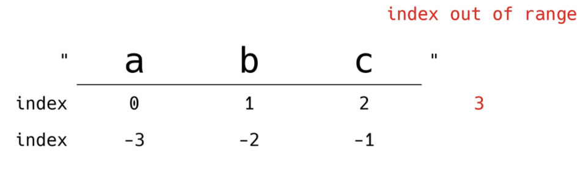

# 데이터 구조

- 데이터에 편리하게 접근하고, 변경하기 위해 데이터를 저장하거나 조작하는 법
- 순서가 있는 데이터 구조
  - 문자열(String)
  - 리스트(List)
- 순서가 없는 데이터 구조
  - 세트(Set)
  - 딕셔너리(Dictionary)


## 문자열

- 문자들의 나열(sequence of characters)

- 문자열의 특징

  - 변경할 수 없고(immutable)

  ```python
  a = 'my string?'
  a[-1] = '!'
  ```

  TypeError: 'str' object does not support item assignment

  - 순서가 있고(ordered)
  - 순회 가능한(iterable)

  ```python
  a = '123'
  for char in a:
      print(char, end = ' ')
  ```

  1 2 3

#### 문자열 인덱스(Index)

- 파이썬에서 문자열은 아래와 같이 접근할 수 있음



#### 문자열 자르기(Slicing)

- 파이썬에서 문자열은 아래와 같이 자를 수 있음


```python
s[2:5] => 'cde'
s[-6:-2] => 'defg'
s[2:-4] => 'cde'
s[2:5:2] = > 'ce'
s[-6:-1:3] => 'dg'
s[2:5:-1] => ''              # 방향이 반대로 되야함. 해당되는 값이 없으면 빈문자열 출력
s[5:2:-1] => 'fed'
s[:3] => 'abc'               # 처음부터 3까지
s[5:] => 'fghi'              # 5부터 끝까지
s[::] => 'abcdefghi'         # s[0:len(S):1]과 동일, 처음부터 끝까지 1만큼씩
s[::-1] => 'ihgfedcba'       # s[-1:-(len(s)+1):-1]과 동일, 반대방향(뒤집기)
```


### 문자열 조회/탐색

#### .find(x)

- x의 첫 번째 위치를 반환. 없으면 -1을 반환함.

```python
'apple'.find('p')
```

1

```python
'apple'.find('k')
```

-1

#### .index(x)

- x의 첫 번째 위치를 반환. 없으면 오류 발생

```python
'apple'.index('p')
```

1

```python
'apple'.index('k')
```

ValueError: substring not found


### 문자열 변경

#### .replace(*old, new[,count]*)

- 바꿀 대상 글자를 새로운 글자로 바꿔서 반환
- count를 지정하면, 해당 개수만큼만 시행

```python
'coone'.replace('o','a')
```

'caane'

```python
'wooooowoo'.replace('o','!',2)
```

'w!!ooowoo'

#### .strip(*[chars]*)

- 특정한 문자들을 지정하면,
  - 양쪽을 제거하거나(strip), 왼쪽을 제거하거나(lstrip), 오른쪽을 제거(rstrip)
- 문자열을 지정하지 않으면 공백을 제거함

```python
'		와우!\n'.strip()
```

'와우!'                       #왼쪽 공백, 오른쪽 개행 다 사라짐.

```python
'      와우!\n'.lstrip()
```

'와우!\n'                   #왼쪽 공백만 사라짐.

```python
'      와우!\n'.rstrip()
```

' 		와우!'              #오른쪽 개행만 사라짐.

```python
'안녕하세요????'.rstrip('?')
```

'안녕하세요'            # 오른쪽 ? 사라짐.

#### .split(*sep=None*)

- 문자열을 특정한 단위로 나눠 리스트로 반환

```python
'a,b,c'.split('_')
```

['a,b,c']               # 분리되지 않고 리스트로 반환

```python
'a b c'.split()
```

['a', 'b', 'c']         # 공백으로 나뉨

#### '*separator*'.join(*[iterable]*)

- 반복가능한(iterable) 컨테이너 요소들을 separator(구분자)로 합쳐 문자열 반환

```python
'!'.join('ssafy')
```

's!s!a!f!y'

```python
' '.join(['3', '5'])
```

'3 5'

#### 

#### .capitalize() : 앞글자를 대문자로

#### .title() : '' 나 공백 이후를 대문자로

#### .upper() : 모두 대문자로

#### .lower() : 모두 소문자로

#### .swapcase() : 대 <-> 소문자로 변경

```python
msg = 'hI! Everyone, I\'m ssafy'
print(msg)                        
# hI! Everyone, I'm ssafy
print(msg.capitalize())           
# Hi! everyone, i'm ssafy
print(msg.title())
# Hi! Everyone, I'm Ssafy
print(msg.upper())
# HI! EVERYONE, I'M SSAFY
print(msg.lower())
# hi! everyone, i'm ssafy
print(msg.swapcase())
# Hi! eVERYONE, i'M SSAFY
```

### 문자열 관련 검증 메소드

#### .isalpha() : 알파벳 문자 여부 (단순 알파벳이 아닌 유니코드 상 Leeter(한국어도 포함))

#### .isupper() : 대문자 여부

#### .islower() : 소문자 여부

#### .istitle() : 타이틀 형식 여부

```python
'abc'.isalpha()
# True
'ㄱㄴㄷ'.isalpha()
# True
'Ab'.isupper()
# False
'ab'.islower()
# True
'Title Title!'.istitle()
# True
```

