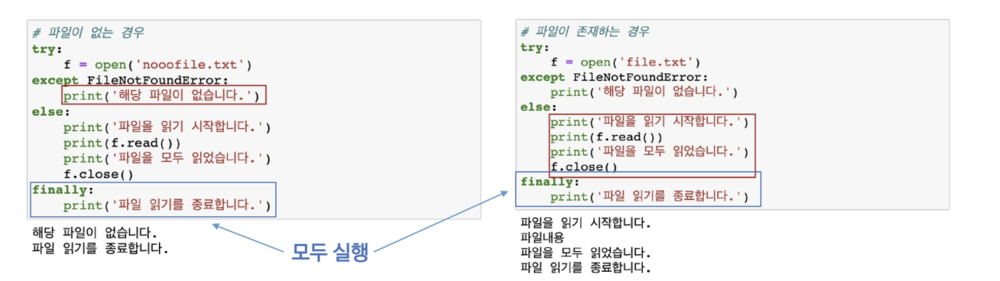
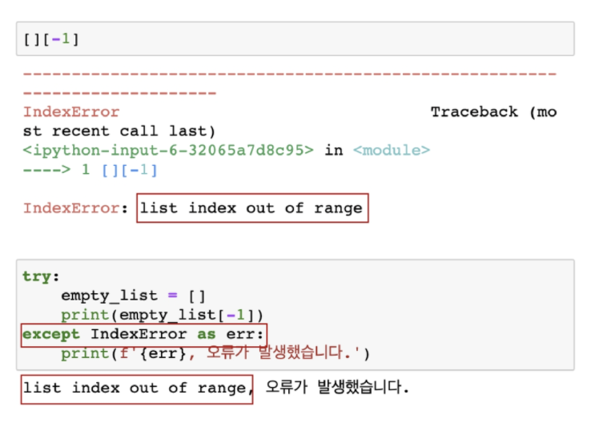
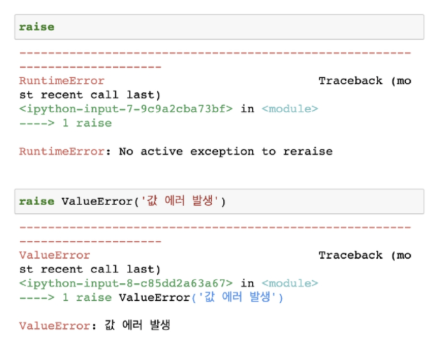
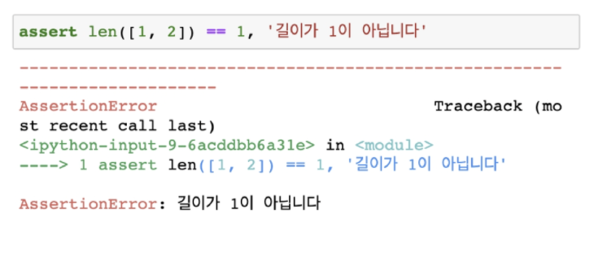

# 예외 처리(handling exception)

- try 문(statement) / except 절(clause)을 이용하여 예외 처리를 할 수있음
- try 아래의 코드 블록이 실행됨
  - 예외가 발생되지 않으면, except 없이 실행 종료
  - 예외가 발생하면, except 절이 실행됨

```python
try:
    실행할 코드
except:
    예외가 발생했을 때 처리하는 코드
```

```python
try:
    num = input('숫자입력 :')
    print(int(num))
except ValueError:                    # ValueError일 때만 예외처리함
    print('숫자가 아닙니다')
```

- try - 코드를 실행함
- except - try 문에서 예외가 발생 시 실행함
- else  - try 문에서 예외가 발생하지 않으면 실행함
- finally -  예외 발생 여부와 관계없이 항상 실행함

##### 파일을 열고 읽는 코드를 작성하는 경우

- 파일 열기 시도
  - 파일 없는 경우 => '해당 파일이 없습니다.' 출력(except)
  - 파일 있는 경우 => 파일 내용을 출력 (else)
- 해당 파일 읽기 작업 종료 메시지 출력(finally)



> 예외 발생할 때 VS 예외 발생하지 않을 때 

| 예외 O |         | 예외 X |
| :----: | :-----: | :----: |
|   V    |   try   |   V    |
|   V    | except  |        |
|        |  else   |   V    |
|   V    | finally |   V    |

- as 키워드를 활용하여 원본 에러 메시지를 사용할 수 있음
  - 예외를 다른 이름에 대입



### 예외 발생시키기

#### raise statement

- raise를 통해 예외를 강제로 발생
  - raise <표현식>(메시지)
    - 표현식 : 예외 타입 지정(주어지지 않을 경우 현재 스코프에서 활성화된 마지막 예외를 다시 일으킴)



#### assert statement

- assert 를 통해 예외를 강제로 발생
- assert는 상태를 검증하는데 사용되며, 무조건 AssertionError가 발생
- 일반적으로 디버깅 용도로 사용
  - assert <표현식>, <메시지>
    - 표현식 : False인 경우 Assertion Error



### 파이썬은 try , except를 권장한다!

.assets/image-20210721160000827.png)

.assets/image-20210721155543450.png)

