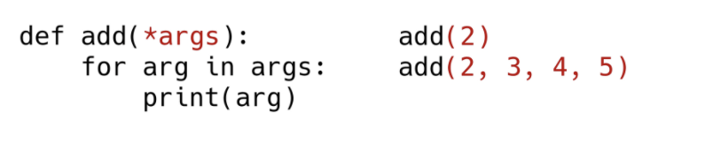

# 함수(Function)

- 특정한 기능을 하는 코드의 조각(묶음)
- 하나의 큰 프로그램을 여러 부분으로 나누어 같은 함수를 여러 상황에서 호출하고(높은 재사용성), 일부분을 수정하기 쉽다(유지보수 용이)는 장점을 가짐
- 함수의 특징
  - 함수의 이름
  - 함수의 매개변수(parameters)
  - 함수의 바디(body) - Docstring(선택적) 및 코드셋
  - 함수의 반환값(return)

> Docstring (Document String) - 함수나 클래스의 설명


### 내장함수(Built-in Functions)

- 파이썬 인터프리터에는 항상 사용할 수 있는 많은 함수와 형(type)이 내장되어 있음


### 함수의 선언

- 함수의 선언은 def 키워드를 활용함
- 들여쓰기를 통해 함수 body(실행될 코드 블록)를 작성함
  - Docstring은 함수 body 앞에 선택적으로 작성 가능
    - 작성시에는 반드시 첫번째 문장에 문자열 ''' ''''
- 함수는 매개변수(parameter)를 넘겨줄 수 도 있음
- 함수는 동작 후에 return을 통해 결과값을 전달함
  - 반드시 하나의 객체를 반환

- 함수는 함수명()으로 호출
  - 매개변수가 있는 경우, 함수명(값1, 값2, ... )fh ghcnf

```python
def foo():
    return True

foo()

def add(x, y):
    return x + y

add(2,3)
```

 ### 함수의 리턴(return)

- 함수는 항상 반환되는 값이 있으며, 어떠한 객체라도 상관 없음

- 오직 한 개의 객체만 return 됨

  - 복수의 객체를 return 하는 경우  => 복수의 객체를 하나의 tuple로 반환

  ```python
  def foo(a, b):
      return a+b, a-b
   
  foo(1,2)          
  #(3, -1)   - 하나의 객체(tuple)가 반환
  ```

  - 명시적인 return 값이 없는 경우  => None을 반환

  ```python
  def greeting():
      print('hi')
      
  greeting()
  # hi       - 하나의 객체(None)을 반환
  ```

  > return vs print
  >
  > > return은 함수 안에서만 사용되는 키워드
  > >
  > > print는 출력을 위해 사용되는 함수


### 함수 input

#### 위치 인자(Positional Arguments)

- 기본적으로 함수 호출 시 인자는 위치에 따라 함수 내에 전달됨


#### 기본 인자 값(Default Arguments Values)

- 기본값을 지정하여 함수 호출 시 인자 값을 설정하지 않도록 함
  - 정의된 것보다 더 적은 개수의 인자들로 호출 될 수 있음


#### 키워드 인자(Keyword Arguments)

- 직접 변수의 이름으로 특정 인자를 전달할 수 있음
- 키워드 인자 다음에 위치 인자를 활용할 수 없음


#### 가변 인자 리스트(Arbitray Argument Lists)

- 함수가 임의의 개수 인자로 호출될 수 있도록 지정
- 인자들은 튜플로 묶여 처리되며, 매개변수에 *을 붙여 표현



#### 가변 키워드 인자(Arbitrary Keyword Arguments)

- 함수가 임의의 개수 인자를 키워드 인자로 호출될 수 있도록 지정
- 인자들은 딕셔너리로 묶여 처리되며, 매개변수에 **를 붙여 표현


#### 위치인자와 *args, **kwargs를 함께 사용했을 때 올바른 순서


> parameter(매개변수)
>
> > 함수에 입력으로 전달된 값을 받는 변수
> >
> > ```python
> > def my_func(a, b):
> >     pass
> > ```


> argument({전달}인자, 인수)
>
> > 함수를 호출할 때 함수에 전달하는 입력 값
> >
> > ```python
> > my_func(1, 2)
> > ```


### 함수 스코프(scope)

- 함수는 코드 내부에 지역 스코프(local scope)를 생성하며, 그 외의 공간인 전역 스코프(global scope)로 구분

- 스코프
  - 전역 스코프(global scope) : 코드 어디에서든 참조할 수 있는 공간
  - 지역 스코프(local scope) : 함수가 만든 스코프. 함수 내부에서만 참조 가능
- 변수
  - 전역 변수(global variable) : 전역 스코프에 정의된 변수
  - 지역 변수(local variable) : 지역 스코프에 정의된 변수

#### 변수 수명주기(lifecycle)

- 변수는 각자의 수명주기(lifecycle)가 존재
  - 빌트인 스코프(built-in scope)
    - 파이썬이 실행된 이후부터 영원히 유지
  - 전역 스코프(global scope)
    - 모듈이 호출된 시점 이후 혹은 인터프리터가 끝날 때까지 유지
  - 지역(함수) 스코프(local scope)
    - 함수가 호출될 때 생성되고, 함수가 종료될 때까지 유지

#### LEGB Rule

- 이름 검색 규칙(Name Resolution)
- 파이썬에서 사용되는 이름(식별자)들은 이름공간(namespace)에 저장되어 있음
- 아래와 같은 순서로 이름을 찾아나가며, LEGB Rule이라고 부름
  - Local scope : 함수
  - Enclosed scope : 특정 함수의 상위 함수
  - Global scope : 함수 밖의 변수, Import 모듈
  - Built-in scope : 파이썬 안에 내장되어 있는 함수 또는 속성
- 즉, 함수 내에서는 바깥 스코프의 변수에 접근 가능하나 수정은 할 수 없음


#### global

- 현재 코드 블록 전체에 적용되며, 나열된 식별자(이름)들이 전역 변수임을 나타냄
  - global에 나열된 이름은 같은 코드 블록에서 global 앞에 등장할 수 없음
  - global에 나열된 이름은 매개변수, for 루프 대상, 클래스/함수 정의 등으로 정의되지 않아야 함


#### nonlocal

- 전역을 제외하고 가장 가까운 (둘러 싸고 있는) 스코프의 변수를 연결하도록 함
  - nonlocal에 나열된 이름은 같은 코드 블록에서 nonlocal 앞에 등장할 수 없음
  - nonlocal에 나열된 이름은 매개변수, for 루프 대상, 클래스/함수 정의 등으로 정의되지 않아야 함
- global과는 달리 이미 존재하는 이름과의 연결만 가능함


#### 주의

- 기본적으로 함수에서 선언된 변수는 Local scope에 생성되며, 함수 종료 시 사라짐

- 해당 스코프에 변수가 없는 경우 LEGB rule에 의해 이름을 검색함

  - 변수에 접근은 가능하지만, 해당 변수를 수정할 수는 없음

  - 값을 할당하는 경우 해당 스코프의 이름공간에 새롭게 생성되기 때문

  - 단, 함수 내에서 필요한 상위 스코프 변수는 인자로 넘겨서 활용할 것(클로저* 제외)

    > (참고) 클로저란? 어떤 함수 내부에 중첩된 형태로써 외부 스코프 변수에 접근 가능한 함수

- 상위 스코프에 있는 변수를 수정하고 싶다면 global, nonlocal 키워드를 활용 가능
  - 단, 코드가 복잡해지면서 변수의 변경을 추적하기 어렵고, 예기치 못한 오류가 발생
  - 가급적 사용하지 않는 것을 권장하며, 함수로 값을 바꾸고자 한다면 항상 인자로 넘기고 리턴 값을 사용하는 것을 추천


### 재귀 함수(recursive function)

- 자기 자신을 호출하는 함수
- 무한한 호출을 목표로 하는 것이 아니며, 알고리즘 설계 및 구현에서 유용하게 활용
  - 알고리즘 중 재귀 함수로 로직을 표현하기 쉬운 경우가 있음(예 - 점화식)
  - 변수의 사용이 줄어들며, 코드의 가독성이 높아짐
- 1개 이상의 base case(종료되는 상황)가 존재하고, 수렴하도록 작성
  - 같은 문제를 다른 Input 값을 통해서 해결하는 과정
    - 큰 문제를 해결하기 위해 작은 문제로 좁히고, 작은 문제의 해답을 이용하여 해결
  - 작은 문제는 base case에 도달하여 재귀 함수가 끝날 수 있도록 함

#### 재귀 함수 주의사항

- 재귀 함수는 base case에 도달할 때까지 함수를 호출함
- 메모리 스택이 넘치게 되면(stack overflow) 프로그램이 동작하지 않게 됨
- 파이썬에서 최대 재귀 깊이(maximum recursion depth)가 1,000번으로 호출 횟수가 이를 넘어가게 되면 Recursion Error 발생