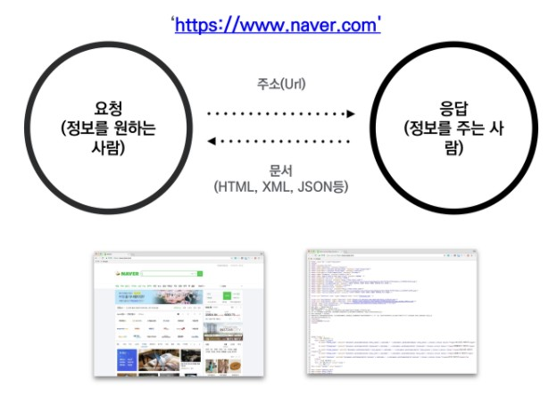

# 웹크롤링(Web Crawling)

> 조직적, 자동화된 방법으로 웹을 탐색하는 것.




### requests

- 파이썬이 주소에 대한 요청을 보냄
- $ pip install requests 

```python
import requests

requests = requests.get('주소')        #'주소'에 요청(request)를 보내서, 정보를 받아줘(get)
requests = requests.get('주소').text   #'주소'에 요청 보내서, 정보 받아서, 글(text)만 뽑아줘
requests = requests.get('주소').status_code #'주소'에 요청 보내서, 정보 받아서, 상태(status_code)만 뽑아줘
```


### Beautifulsoup

- pip install beautifulsoup4
- 받은 문서를 검색하기 좋게 만들어줌

```python
from bs4 import BeautifulSoup

html = BeautifulSoup(response,'html.parsing')
data = html.select('selector')      # 문서 안에 있는 특정 내용을 뽑아줘(select)
data = html.select_one('selector')  # 문서 안에 있는 특정 내용을 하나만 뽑아줘(select_one)
```


## Summary

### 정보 스크랩 1단계

1. 원하는 정보가 있는 주소로 요청을 보내, 응답을 저장한다.

```python
import requests
response = requests.get(url).text
```

2. 정보를 출력하여 확인한다.

```python
print(respose)
```

### 정보 스크랩 2단계

1. 정보를 조작하기 편하게 바꾸고

```python
from bs4 import BeautifulSoup
data = BeautifulSoup(response)
```

2. 바꾼 정보 중 원하는 것만 뽑아서

```python
kospi=data.select_one('selector 경로')
```

3. 출력한다.

```python
print(kospi.text)
```


> 개발자 도구 - F12
>
> 장치 에뮬레이션 토글을 이용해 모바일 모드로 볼 수 있음.


### JSON(javaScript Object Notation)

- 데이터만을 주고 받기 위한 표기법
- 파이썬의 Dictionary와 List 구조로 쉽게 변환하여 활용할 수 있다.


