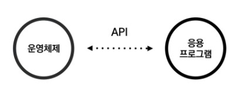
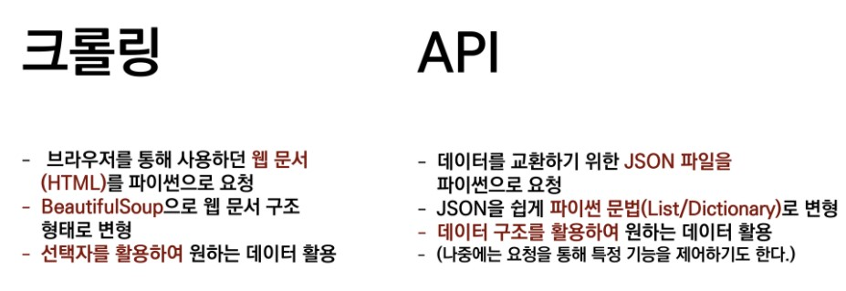

# API

> Application Programming Interface, 응용 프로그램 프로그래밍 인터페이스

- 응용 프로그램에서 사용할 수 있도록, 운영 체제나 프로그래밍 언어가 제공하는 기능을 제어할 수 있게 만든 인터페이스
- 서비스와 서비스 간의 프로그래밍을 통한 대화 방식
- 요청을 받는 측에서 일정한 방식을 명세 => 해당 방식대로 요청을 하면 정보 제공

### 사용의 핵심!

- 가이드를 활용하여 요청을 위한 '주소(URL)'를 만든다.
  1. API key 값을 확인한다.
  2. 요청변수에 맞춰 값을 채워넣는다.
  3. 결과를 확인한다.

### 텔레그램 봇 API 활용하기

1. Authorizing your bot

   > 봇이 만들어지면서 동시에 생성되었던 token을 요청 시 인증에 사용

2. Making requests

   > HTTPS 요청을 통해 처리한다는 것과 URL 구조 확인하기

3. getMe 메서드

   > 응답 받는 json 데이터 확인

4. getUpdates 메서드

   > 나의 chat id를 찾기 위해 getUpdates 메서드 요청하기
   >
   > 텔레그램에서 유저를 구분하기위해 사용되는 id
   >
   > 누군가 bot에게 메세지를 보내면 답을 해야 하는데, 그 때 답을 누구에게 할지는 cht_id를 통해서 알 수 있음

### 봇으로 사용자에게 메세지 보내기

1. 원하는 메서드 찾기

   >목적에 맞는 사용 가능한 메서드 문서 읽어보기

2. sendMessage 메서드

3. 에러 응답 확인

4. sendMessage 돌아가기

   > 요청에 필요한 문서 자세히 읽어보기
   >
   > Required 파라미터가 필요한 것 확인

5. sendMessage 재시도
6. 텔레그램 확인

### 브라우저가 아닌 파이썬 파일을 실행하여 메시지 보내기

1. 기본 값 설정
2. requests를 활용한 요청
3. chat id 저장 & 메시지 작성
4. 최종 요청 보내기