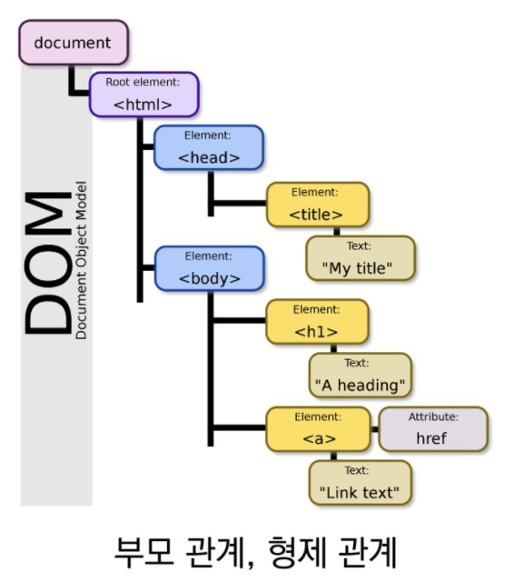
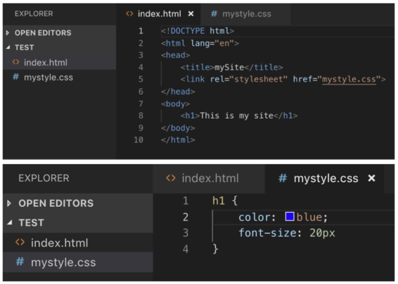
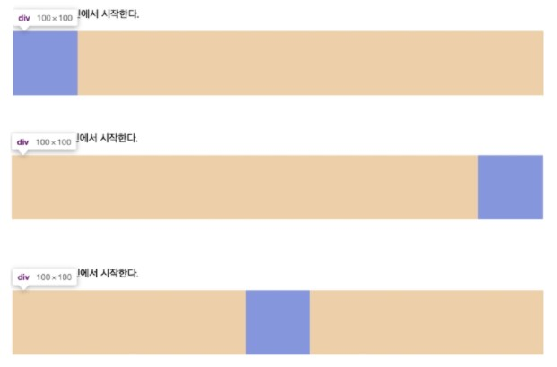
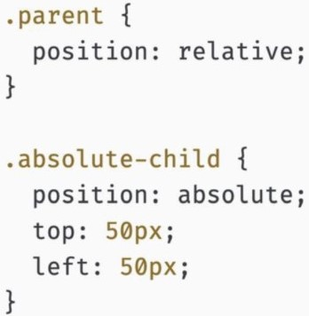

[TOC]

# HTML

- 웹 페이지를 작성하기 위한(구조를 잡기 위한) 언어
- 웹 컨테츠의 '의미'와 '구조'를 정의

## Hyper Text Markup Language

- Hyper
  - 텍스트 등의 정보가 동일 선상에 있는 것이 아니라 다중으로 연결되어 있는 상태
- Hyper Text
  - 참조(하이퍼링크)를 통해 사용자가 한 문서에서 다른 문서로 즉시 접근할 수 있는 텍스트
  - Hyper Text가 쓰인 기술들 중 가장 중요한 2가지
    - http / html
- Markup language
  - 태그 등을 이용하여 문서나 데이터의 구조를 명시하는 언어
  - 프로그래밍 언어와는 다르게 단순하게 데이터를 표현하기만 한다.
  - 대표적인 예 - HTML, Markdown

## HTML 기본구조

### html 요소

### head 요소

### body 요소

### 메타 데이터를 표현하는 새로운 규약, Open Graph Protocol

- HTML 문서의 메타 데이터를 통해 문서의 정보를 전달
- 페이스북에서 만들었으며, 메타정보에 해당하는 제목, 설명 등을 쓸 수 있도록 정의

### DOM(Document Object Model) 트리

- DOM은 문서의 구조화된 표현(Structured Representation)을 제공하며, 프로그래밍 언어가 DOM 구조에 접근할 수 있는 방법을 제공하여 그들이 문서 구조, 스타일 내용 등을 변경 할 수 있게 도움
- DOM은 동일한 문서를 표현하고, 저장하고, 조작하는 방법을 제공
- Web Page의 객체 지향 표현

### 요소(element, tag)

- HTML의 요소는 태그와 내용(contents)로 구성되어 있다.

- HTML 요소는 시작 태그와 종료 태그 그리고 태그 사이에 위치한 내용으로 구성
  - 태그(Element, 요소)는 컨텐츠(내용)를 감싸는 것으로 그 정보의 성격과 의미를 정의
- 내용이 없는 태그들
  - br, hr, img, input, link, meta
- 요소는 중첩(nested)될 수 있음
  - 요소는 중첩을 통해 하나의 문서를 구조화
  - 여는 태그와 닫는 태그의 쌍을 잘 확인해야함
  - 오류를 반환하는 것이 아닌 그냥 레이아웃이 깨진 상태로 출력되기 때문에, 디버깅이 힘들어 질 수 있음.

### 속성(attribute)

- 태그별로 사용할 수 있는 속성은 다르다.

- 작성 방식 통일하기
  - 공백은 No!
  - " "(쌍따옴표) 사용!
- 속성을 통해 태그의 부가적인 정볼르 설정할 수 있음
- 요소는 속성을 가질 수 있으며, 경로나 크기와 같은 추가적인 정보를 제공
- 요소의 시작 태그에 작성하며 보통 이름과 값이 하나의 쌍으로 존재
- 태그와 상관없이 사용 가능한 속성(HTML Global Attribute)들도 있음
  - 모든 HTML 요소가 공통으로 사용할 수 있는 속성(몇몇 요소에는 아무 효과가 없을 수 있음)
    - id, class, hidden, lang, style, tabindex, title
- 주석 - <! -- 내용~~~ -- >

### 시맨틱 태그

- HTML5에서 의미론적 요소를 담은 태그의 등장. ~~div~~
- 대표적인 태그들
  - header : 문서 전체나 섹션의 헤더(머릿말 부분)
  - nav : 네비게이션
  - aside : 사이드에 위치한 공간, 메인 콘텐츠와 관련성이 적은 콘텐츠
  - section : 문서의 일반적인 구분, 컨텐츠의 그룹을 표현
  - article : 문서, 페이지, 사이트 안에서 독립적으로 구분되는 영역
  - footer : 문서 전체나 섹션의 푸터(마지막 부분)

- 개발자 및 사용자 뿐만 아니라 검색엔진 등에 의미 있는 정보의 그룹을 태그로 표현
- 단순히 구역을 나누는 것 뿐만 아니라 '의미'를 가지는 태그들을 활용하기 위한 노력
- Non semantic 요소는 div, span 등이 있으며 h1, table 태그들도 시맨틱 태그로 볼 수 있음
- 요소의 의미가 명확해지기 때문에 코드의 가독성을 높이고 유지보수를 쉽게 함
- 검색엔진최적화(SEO)를 위해서 메타태그, 시맨틱 태그 등을 통한 마크업을 효과적으로 할 필요가 있음

### 시맨틱 웹

- 웹 상에 존재하는 수많은 웹 페이지들에 메타데이터를 부여하여,
- 기존의 단순한 데이터의 집합이었던 웹페이지를 '의미'와 '관련성'을 가지는 거대한 데이터베이스로 구축하고자 하는 발상

## HTML 문서 구조화

### 인라인 / 블록 요소

- CSS 에서 다룸!

### 그룹 컨텐츠

- 
, 
, <ol>, <ul>, <pre>, <blockquote>, 

### 텍스트 관련 요소

- < a >, < b > vs < strong > , < i > vs < em > , < span >,  < img >, < br >
  - < b > : 표현상 굵게 표시, < strong > : 강조

### table

- < tr> , < td >, < th >, < thead >, < tbody >, < tfoot >, < caption > 
- 셀 병합 속성 : colspan, rowspan
- scope 속성
- < col >, < colgroup >

### form

- <form> 은 서버에서 처리될 데이터를 제공하는 역할

- < fom >의 기본 속성
  - action : 어디로 보낼지 
  - method

### input

- 다양한 타입을 가지는 입력 데이터 필드
- < label > : 서식 입력 요소의 캡신
- < input > 공통 속성
  - name, placeholder, required, autofocus

- < input > 요소의 동작은 type에 따라 달라지므로, 각각의 내용을 숙지할 것.

> [: 입력 요소 - HTML: Hypertext Markup Language | MDN (mozilla.org)](https://developer.mozilla.org/ko/docs/Web/HTML/Element/Input)

# CSS

- Cascading Style Sheets
- 스타일, 레이아웃 등을 통해 문서(HTML)를 표시하는 방법을 지정하는 언어

## CSS 구문

- CSS 구문은 선택자와 함께 열림
- 선택자를 통해 스타일을 지정할 HTML 요소를 선택
- 중괄호 안에서는 속성과 값, 하나의 쌍으로 이루어진 선언을 진행
- 각 쌍은 선택한 요소의 속성, 속성에 부여할 값을 의미.
  - 속성 (Property) : 어떤 스타일 기능을 변경할지 결정
  - 값 (value) : 어떻게 스타일 기능을 변경할지 결정

### CSS 정의 방법

- 인라인(inline)
  - 해당 태그에 직접 style 속성을 활용

- 내부 참조(embedding) - < style >
  - head 태그 내에 < style > 에 지정

- 외부 참조(link file) - 분리된 CSS 파일
  - 외부 CSS 파일을 < head >내 < link >를 통해 불러오기

- 내부와 외부 차이

|                       내부                       |                       외부                       |
| :----------------------------------------------: | :----------------------------------------------: |
|  |  |

## CSS Selectors

### 선택자 (Selector)

- HTML  문서에서 특정한 요소를 선택하여 스타일링 하기 위해서는 반드시 선택자라는 개념이 필요하다.
- 기본 선택자
  - 전체 선택자, 요소 선택자
  - 클래스 선택자, 아이디 선택자, 속성 선택자
- 결합자 (Combinators)
  - 자손 결합자, 자식 결합자
  - 일반 형제 결합자, 인접 형제 결합자
- 의사 클래스/요소(pseudo class)
  - 링크, 동적 의사 클래스
  - 구조적 의사 클래스, 기타 의사 클래스, 의사 엘리먼트, 속성 선택자

### 기본 선택자

- 요소 선택자
  - HTML 태그를 직접 선택
- 클래스(class) 선택자
  - 마침표(.)문자로 시작하며, 해당 클래스가 적용된 모든 항목을 선택
- 아이디(id) 선택자
  - '#'  문자로 시작하며,  해당 아이디가 적용된 모든 항목을 선택
  - 일반적으로 하나의 문서에 1번만 사용(Unique)
  - 여러 번 사용해도 동작하지만, 단일 id를 사용하는 것을 권장

### CSS 적용 우선순위 (cascading order)  -- 완전 중요!!!!!!

- CSS 우선순위를 아래와 같이 그룹을 지어볼 수 있다.
  1. 중요도 (Importance) - 사용시 주의
     - !important
  2. 우선 순위 (Specificity)
     - 인라인 > id 선택자 > class 선택자, 속성 선택자, pseudo-class > 요소 선택자, pseudo-element
  3. 소스 순서
     - 마지막 순서

- 정답

### CSS 상속

- CSS는 상속을 통해 부모 유소의 속성을 자식에게 상속한다.

  - 속성(프로퍼티) 중에는 상속이 되는 것과 되지 않는 것들이 있다.

  - 상속 되는 것 예시

    > 예 ) Text 관련 요소(font, color, text-align), opacity, visibility 등 

  - 상속 되지 않는 것 예시

    > 예 ) Box model 관련 요소(width, height, margin, padding, border, box-sizing, display),
    >
    > position 관련 요소(position, top/right/bottom/left, z-index) 등

[MDN 상속]: 상속-CSS:CascadingStyleSheets|MDN(mozilla.org)(https://developer.mozilla.org/ko/docs/Web/CSS/inheritance)

## CSS 단위

### 크기 단위

- px (픽셀) - 기본은 16px

  - 모니터 해상도의 한 화소인 '픽셀'을 기준
  - 픽셀의 크기는 변하지 않기 때문에 고정적인 단위

- %

  - 백분율 단위

  - 가변적인 레이아웃에서 자주 사용

- em

  - (바로 위, 부모 요소에 대한) 상속의 영향을 받음
  - **배수 단위, 요소에 지정된 사이즈에 상대적인 사이즈를 가짐.**

- rem

  - (바로 위, 부모 요소에 대한) 상속의 영향을 받지 않음
  - **최상위 요소(html)의 사이즈를 기준으로 배수 단위를 가짐.**

> Quiz

>  정답

​		- em은 위에 부모의 영향을 받기 때문에 (x1.5em) x (x1.5em) 한 것임.  rm은 그냥 (x1.5rem)임

- viewport
  - 웹 페이지를 방문한 유저에게 바로 보이게 되는 웹 컨텐츠의 영역
  - 주로 스마트폰이나 테블릿 디바이스의 화변을 일컫는 용어로 사용됨
  - 글자 그대로 디바이스의 viewport를 기준으로 상대적인 사이즈가 결정됨
  - **vw, vh, vmin, vmax**

### 색상 단위

1. 색상 키워드
   - 대소문자를 구분하지 않음
   - red, blue, black 과 같은 특정 색을 직접 글자로 나타냄
2. RGB 색상
   - 16진수 표기법 혹은 함수형 표기법을 사용해서 특정 색을 표현하는 방식
     - '#' + 16진수 표기법
     - rgb() 함수형 표기법
3. HSL 색상
   - 색상, 채도, 명도를 통해 특정 색을 표현하는 방식
     - *a는 alpha(투명도)가 추가된 것

> [ - CSS: Cascading Style Sheets | MDN (mozilla.org)](https://developer.mozilla.org/ko/docs/Web/CSS/color_value)

### CSS 문서 표현

- 텍스트
  - 변형 서체(vs < b >, < i > vs < strong >. < em >)
  - 자간, 단어 간격, 행간, 들여쓰기
  - 기타 꾸미기
- 컬러(color), 배경(background-image, background-color)
- 목록 꾸미기
- 표 꾸미기

## Selectors 심화

### 결합자(Combinators)

- 자손 결합자
  - selectorA 하위의 모든 selecotrB 요소
- 자식 결합자
  - selectorA 바로 아래의 selecotrB 요소
- 일반 형제 결합자
  - selecotrA의 형제 요소 중 뒤에 위치하는 selectorB 요소를 모두 선택
- 인접 형제 결합자
  - selectorA의 형제 요소 중 바로 뒤에 위치하는 selectorB 요소를 선택

|           자손 결합자            |                 자식 결합자                  |
| :------------------------------: | :------------------------------------------: |
|  |  |

|           일반 형제 결합자            |           인접 형제 결합자           |
| :-----------------------------------: | :----------------------------------: |
|  |  |

## Box model

### Box model 구성

- 모든 HTML d요소는 box 형태로 되어있음
- 하나의 박스는 네 부분(영역)으로 이루어짐
  - content, padding, border, margin

|           margin           |            padding            |
| :------------------------: | :---------------------------: |
|  |  |

|            border            |
| :--------------------------: |
|  |

|      margin / padding shorthand       |
| :-----------------------------------: |
|  |

|                    border shorthand                    |
| :----------------------------------------------------: |
|  |

### box-sizing

- 기본적으로 모든 요소의 **box-sizing**은 **content-box**
  - **Padding을 제외한 순수 contents 영역만을 box로 지정**
- 다만, 우리가 일반적으로 영역을 볼 떄는 border까지의 너비를 100px 보는 것을 원함
  - 그 경우 box-sizing을 border-box으로 설정

### 마진 상쇄 (Margin collapsing)

- block A의 top과 block B의 bottom에 적용된 각각의 margin이 둘 중에서 큰 마진 값으로 결합(겹쳐지게 )되는 현상

## Display

- HTML 요소들을 시각적으로 어떻게 보여줄지 결정하는 속성

### CSS

- 모든 요소는 네모(박스모델)이고, 어떻게 보여지는지(display)에 따라 문서에서의 배치가 달라질 수 있다.

### display : 인라인 / 블록 요소

- display : **인라인 (inline)**
  - 줄 바꿈이 일어나지 않는 행의 일부 요소
  - content 너비만큼 가로 폭을 차지한다.
  - width, height, margin-top, margin-bottom을 지정할 수 없다.
  - 상하 여백은 line-height로 지정한다.
  - 대표적인 인라인 레벨 요소
    - span / a / img / input, label / b, em , i, strong 등

> [인라인 요소 - HTML: Hypertext Markup Language | MDN (mozilla.org)](https://developer.mozilla.org/ko/docs/Web/HTML/Inline_elements)

- display : **블록 (block)**
  - 줄 바꿈이 일어나는 요소
  - 화면 크기 전체의 가로 폭을 차지한다. (기본은 너비의 100%)
  - 블록 레벨 요소 안에 인라인 레벨 요소가 들어갈 수 있음.
  - 대표적인 블록 레벨 요소
    - div / ul, ol, li / p / hr / form 등

>  [블록 레벨 요소 - HTML: Hypertext Markup Language | MDN (mozilla.org)](https://developer.mozilla.org/ko/docs/Web/HTML/Block-level_elements)

|               인라인               |            블록             |
| :--------------------------------: | :-------------------------: |
| * |  |

### 속성에 따른 수평 정렬

|              인라인              |                                |              블록              |
| :------------------------------: | ------------------------------ | :----------------------------: |
|  |  |  |

- display : **inline-block**
  - block과 inline 레벨 요소의 특징을 모두 갖는다.
  - inline처럼 한 줄에 표시 가능하며,
  - block 처럼 width, height, margin 속성을 모두 지정할 수 있다.
- display : **none**
  - 해당 요소를 화면에 표시하지 않는다. (공간조차 사라진다.)
  - 이와 비슷한 visibility : hidden은 해당 요소가 공간을 차지하나 화면에 표시만 하지 않는다.

> 다양한 display 속성
>
> [display - CSS: Cascading Style Sheets | MDN (mozilla.org)](https://developer.mozilla.org/ko/docs/Web/CSS/display)

## Position

### CSS position

- 문서 상에서 요소를 배치하는 방법을 지정한다.
- **static** : 모든 태그의 기본 값(기준 위치)
  - 일반적인 요소의 배치 순서에 따름(좌측 상단)
  - 부모 요소 내에서 배치될 때는 부모 요소의 위치를 기준으로 배치 됨
- 아래는 좌표 프로퍼티(**top, bottom, left, right**)를 사용하여 이동이 가능하다. (음수 값도 가능)
  - **relative** : 상대 위치
    - 자기 자신의 static 위치를 기준으로 이동
    - 레이아웃에서 요소가 차지하는 공간은 static 일 때와 같음
  - **absolute** : 절대 위치
    - 요소를 일반적인 문서 흐름에서 제거 후 레이아웃에 공간을 차지하지 않음
    - static이 아닌 가장 가까이 있는 부모/조상 요소를 기준으로 이동 (없는 경우 body에 붙는 형태)
  - **fixed** : 고정 위치
    - 요소를 일반적인 문서 흐름에서 제거 후 레이아웃에 공간을 차지하지 않음
    - 부모요소와 관계없이 viewport를 기준으로 이동
    - 스크롤 시에도 항상 같은 곳에 위치함

|                   static                   |                    relative                    |                    absolute                    |                fixed                 |
| :----------------------------------------: | :--------------------------------------------: | :--------------------------------------------: | :----------------------------------: |
|                |                  |                  |             |
|  |  |  |  |

### absolute의 특징

- 원래 위치해 있었던 과거 위치에 있던 공간은 더 이상 존재하지 ㅇ낳음
- 즉, 다른 모든 것과 별개로 독자적인 곳에 놓임
- 페이지의 다른 요소의 위치와 간섭하지 않는 격리된 사용자 인터페이스 기능을 만드는데 활용
  - 팝업 정보 상자, 제어 메뉴, 롤오버 패널, 페이지 어느 곳에서나 끌어서 놓기 할 수 있는 유저 인터페이스 페이지 등등

# 학습 가이드라인

## MDN web docs

>  https://developer.mozilla.org/ko/

## Emmet

- HTML & CSS를 작성할 때 보다 빠른 마크업을 위해서 사용되는 오픈소스
- 단축키, 약어 등을 사용
- 대부분의 텍스트 에디터에서 지원

> https://emmet.io/
>
> https://docs.emmet.io/cheat-sheet/