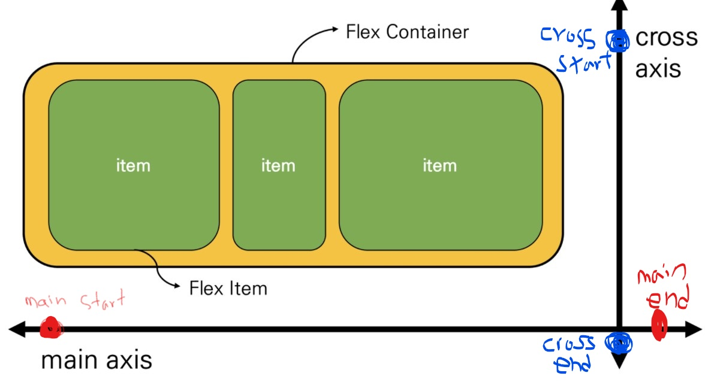

[TOC]

# CSS layout

- 웹 페이지에 포함되는 요소들을 어떻게 취합하고 그것들이 어느 위치에 놓일 것인지를 제어

### CSS page layout techniques

- Display
- Position
- Float
- Flexbox
- Grid System
- Table layout
- Multiple-column layout

## float

- 한 요소(element)가 정상 흐름(normal flow)으로부터 빠져 텍스트 및 인라인(inline) 요소가 그 주위를 감싸 요소의 좌,우측을 따라 배치되어야 함을 지정
- 본래는 이미지 좌, 우측 주변으로 텍스트를 둘러싸는 레이아웃을 위해 도입
- 더 나아가 이미지가 아닌 다른 요소들에도 적용해 웹 사이트의  전체 레이아웃을 만드는데까지 발전

### float 속성

- none : 기본값
- left : 요소를 왼쪽으로 띄움
- right : 요소를 오른쪽으로 띄움  

### Float clear

#### 가상요소(::after)

- 선택한 요소의 맨 마지막 자식으로 가상 요소를 하나 생성
- 보통 content 속성과 함께 짝지어, 요소에 장식용 콘텐츠를 추가할 때 사용
- 기본값은 inline

#### clear

- 선행 floating 요소 다음일 수 있는지 또는 그 아래로 내려가(해제되어(cleared))야 하는 지를 지정
- clear 속성은 부동 및 비부동 요소 모두에 적용됨

### Float 정리

- flexbox 및 grid 레이아웃과 같은 기술이 나오기 이전에 Float은 열 레이아웃을 만드는데 사용됨
- flexbox와 grid의 출현과 함께 결국 원래 텍스트 블록 내에서 float 이미지를 위한 역할로 돌아감
  - MDN에서는 더 새롭고 나은 레이아웃 기술이 나와있으므로 "legacy 레이아웃 기술"로 분류
- 웹에서 여전히 사용하는 경우도 있음 (ex. naver의 nav bar)

## Flexbox

### CSS Flexible Box Layout

- 오랫동안 CSS Layout을 작성할 수 있는 도구는 float 및 positioning 뿐이었음
  - 문제가 있는 것은 아니었지만, 어떤 면에서는 제한적이고 한계가 있음
- Flexbox라 불리는 Flexible Box module은 Flexbox 인터페이스 내의 아이템 간 "공간배분"과 강력한 "정렬 기능을 제공하기 위한 1차원 레이아웃 모델로 설계

- 요소 간 공간 배분과 정렬 기능을 위한 1차원(단방향) 레이아웃
- 크게 딱 2가지만 기억하자. 요소와 축!
- 요소
  - Flex Container (부모 요소)
  - Flex Item (자식 요소)
- 축
  - main axis (메인축)
  - cross axis (교차축)

- 기본 값일 때

### Flexbox의 구성요소

- Flex Container (부모 요소) 
  - flexbox 레이아웃을 형성하는 가장 기본적인 모델 - 부모가 정렬될 것들을 컨트롤 함!!
  - Flex Item들이 놓여있는 영역
  - 생성하려면 display 속성을 flex 혹은 inline-flex로 지정
- Flex Item (자식 요소)
  - 컨테이너의 컨텐츠

### flexbox의 시작

### Flex에 적용하는 속성

- 배치 방향 설정
  - flex-direction
- 메인축 방향 정렬
  - justify-content,  ~~justify-self, justify-items~~
- 교차축 방향 정렬
  - align-items, align-self, align-content
- 기타
  - flex-wrap, flex-flow, flex-grow, order, flex-shrink, flex-basis

#### flex-direction

- main-axis 방향만 바뀐다
- flexbox는 단방향 레이아웃이기 때문이다.

#### justify & align

#### content & items & self

- content
  - 여러 줄
- items
  - 한 줄
- self
  - flex item 개별 요소
- 예시
  - justify-content : 메인축 기준 여러 줄 정렬
    - flex-start, flex-end, center, space-between, space-around, space-evenly
  - align-items : 교차축 기준 한 줄 정렬
    - flex-start, flex-end, center, stretch, baseline
  - align-self : 교차축 기준 선택한 요소 하나 정렬
    - auto, flex-start, flex-end, center, baseline.stretch
  - align-content
    - flex-start, flex-end, center, stretch, space-between, space-around

#### 정리

- display: flex
  - 정렬하련느 부모 요소에 작성
  - inline-flex: flex 영역을 블록으로 쓰지 않고 인라인 블록으로 사용
- flex 선언 시 아래 사항들이 기본 값으로 지정됨
  1. item은 행으로 나열
  2. item은 메인축의 시작부터 정렬
  3. item은 교차축의 크기를 채우기 위해 늘어남
  4. flex-wrap 속성을 nowrap으로 지정
- flex-direction
  - item이 쌓이는 방향 설정
  - main-axis가 변경됨
  - row (기본값) : 메인축의 방향이 왼쪽에서 오른쪽
  - row-reverse : 메인축의 방향이 오른쪽에서 왼쪽
  - column : 메인축의 방향이 위에서 아래
  - column-reverse : 메인축의 방향이 아래에서 위
- flex-wrap
  - 요소들이 강제로 한 줄에 배치 되게 할 것인지 여부 설정
  - nowrap (기본 값) : 모든 아이템들 한 줄에 나타내려고 함 -> 그래서 자리가 없어도 튀어나옴
  - wrap : 넘치면 그 다음 줄로
  - wrap-reverse : 넘치면 그 윗줄로(역순)
- flex-flow
  - flex-direction과 flex-wrap의 shorthand
  - flex-direction과 flex-wrap에 대한 설정 값을 차례로 작성
  - 예시) flex-flow: row nowrap;
- jousitfy-content
  - main 축 정렬
  - flex-start (기본 값) : 시작 지점부터 차례로 쌓임
  - flex-end : 쌓이는 방향이 뒤쪽부터 시작 (순서가 역순이 되는게 아니라 아이템들이 뒤로 몰리는 형식)
  - center : 정중앙
  - space-between : 좌우 정렬 (item들 간의 간격이 동일)
  - space-around : 균등 좌우 정렬 (내부 요소 여백은 외곽 여백의 2배)
  - space-evenly : 균등 정렬 (내부 요소 여백과 외각 여백 모두 동일)
- align-items
  - cross축 정렬
  - stretch (기본 값) : 컨테이너를 가득 채움
  - flex-start : 위
  - flex-end :  아래
  - center : 가운데
  - baseline : item 내부의 text에 기준선을 맞춤
- align-self
  - 개별 item에 적용하는 속성 (정렬 방식은 align-items와 동일, 속성이 적용되는 대상이 다름)
  - auto (기본 값)
  - flex-start 
  - flex-end
  - center
  - baseline
  - stretch : 부모 컨테이너에 자동으로 맞춰서 늘어남

- order
  - 작은 숫자 일수록 앞(우선 쌓이는 방향)으로 이동
  - 기본 값 : 0
- flex-grow
  - 주축에서 남는 공간을 항목들에게 분배하는 방법
  - 각 아이템의 상대적 비율을 정하는 것은 아님
  - 기본 값 : 0
  - 음수 불가능

## Bootstrap

### The most popular HTML, CSS, and JS library in the world

- 트위터에서 시작된 오픈 소스 프론트엔드 라이브러리
- 웹 페이지에서 많이 쓰이는 요소 거의 전부를 내장하고 있음
- 별도의 디자인을 할 시간이 크게 줄어들고, 여러 웹 브라우저를 지원하기 위한 크로스 브라우징에 불필요한 시간을 사용하지 않도록 함
- one source multi use
  - 반응형 웹 디자인

### CDN

- Content Delivery(Distribution) Network
- 컨텐츠(CSS, JS, Image, Text 등)을 효율적으로 전달하기 위해, 서버와 사용자 사이의 물리적 거리를 줄여 컨텐츠 로드 지연을 최소화
- 분산 된 서버로 이루어진 플랫폼
  - 전 세계 사용자들이 로딩 시간을 늦추지 않고 동일한 품질의 컨텐츠를 사용할 수 있음
- 장점
  - 사용자와 가까운 서버를 통해 빠르게 전달 가능
  - 외부 서버를 활용함으로써 본인 서버의 부하가 적어짐

## bootstrap gird system

